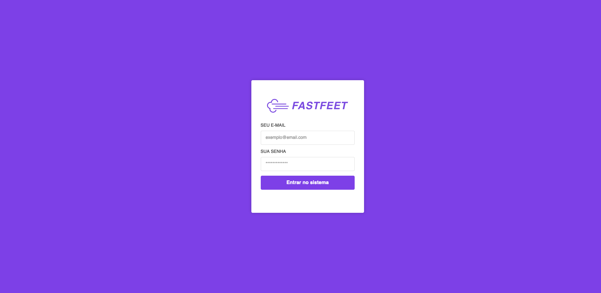
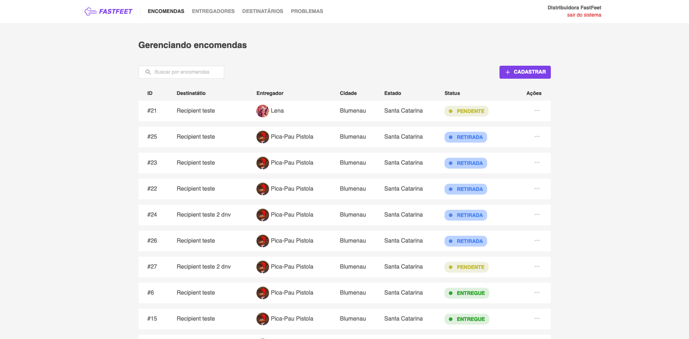

# FastFeet - front-end web

### **Um pouco sobre as ferramentas**
- ESLint + Prettier + EditorConfig;
- Rocketseat Unform
- React Dom
- Reactotron
- Yup (validação de dados)
- Redux
- Redux Persist (persistir autenticação)
- React Toastify

### Informações importantes

1. Antes de cancelar encomendas ou deletar qualquer registro do banco crie uma verificação adicinal usando a função `confirm` do JavaScript;
2. Para formatação de datas utilize sempre a biblioteca `date-fns`;
3. No cadastro/edição de encomendas deve ser possível buscar o entregador e o destinatário pelo nome. Utilize o método `async` da biblioteca [React Select](https://react-select.com/home#async). As encomendas devem ser buscadas da API assim que a página carregar e não devem possuir filtro.

### Opcionais

1. Adicione paginação no front-end e back-end para todas listagens;
2. Utilize máscaras para o input de CEP;
3. Crie um filtro para visualizar apenas as entregas com problemas na listagem de encomendas.

## Tela de Login

## Tela de encomendas

