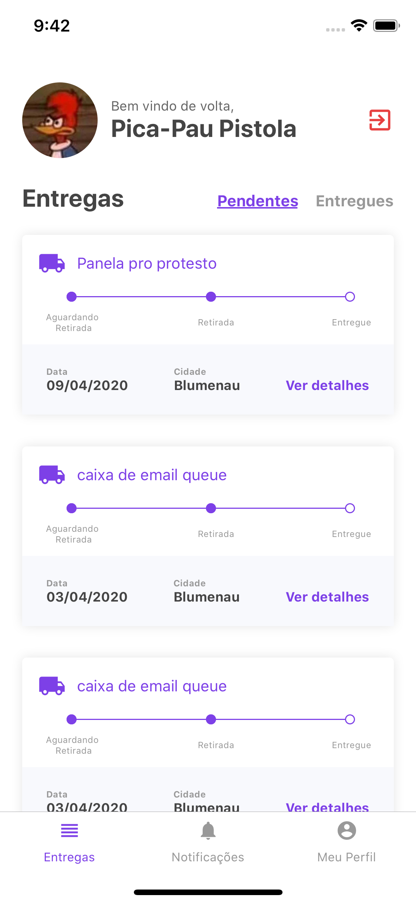
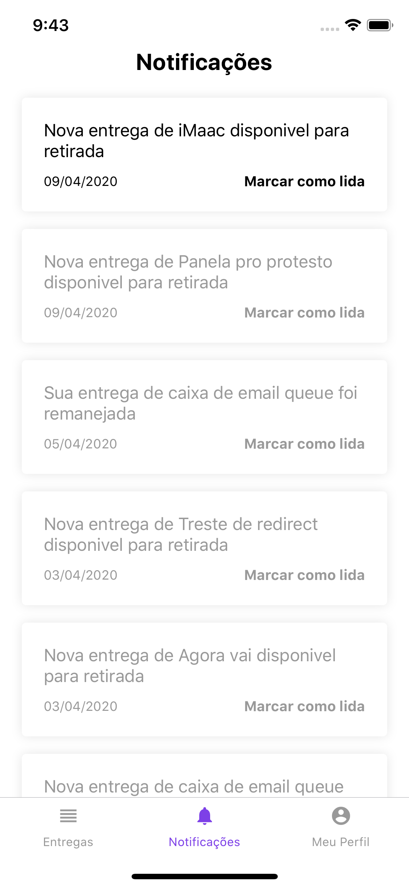

# FastFeet - Mobile

## :rocket: Sobre o app

A aplicação desenvolvida é um app para uma transportadora fictícia, o FastFeet.

Observação: Esta aplicação mobile foi testada apenas para iOS.

Durante esse desafio vamos construir o app mobile da aplicação FastFeet que criamos o back-end durante os desafios dos módulos 02 e 03 de Node.js e front-end no desafio do módulo 09 de ReactJS.

A versão mobile do projeto FastFeet representa a visão do entregador, ou seja, todas funcionalidades presentes nesse projeto são para entregadores.

### Informações importantes

1. Ao confirmar o recebimento da entrega, você deverá utilizar a biblioteca [React Native Camera](https://github.com/react-native-community/react-native-camera) para tirar uma foto da assinatura do destinatário.

### Opcionais

1. Adicione scroll infinito com paginação na listagem de encomendas;

## Tela de Login

## Tela principal

## Detalhes da encomenda

## Tela notificações

## Tela de perfil

